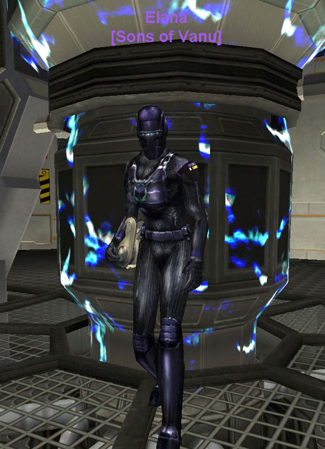

# Weapon tactics

## [Spiker](Spiker.md)

 in the
[Generator](Generator.md) room\]\]

<h3>

Tactics (by [Elana](User:Elana.md))

</h3>

### Damage per shot

The biggest trick to effective use of the spiker is learning how to make
use of the variable power that comes from holding down the trigger.
Holding down the trigger for roughly two seconds will give you a very
lethal full power blast (2-4 shots to kill most infantry plus splash
damage and you can even take down a max with 8-10 shots). This is the
most ammo efficient way to kill somebody but not necessarily the
fastest.

If you need to take somebody down quickly, your best bet is to fire a
number of more rapid shots. You'll improve your
[TTK](Acronyms_and_Slang.md#TTK) at the expense of some ammo. A
good way to get a feel for this is to use the [Enhanced
Targeting](Enhanced_Targeting.md) implant.

### Range

The spiker is best suited for use at range. The weapon has significant
splash damage making it just as likely that you'll kill yourself when
fightin in close quarters. Once you master leading targets it can be an
effective sniping weapon because the splash damage makes up for it's
innacuracy.

An advantage to attacking from a decent range is that you can get all of
your shots into the air before the first one hits because of it's slow
travel time. This allows you to hold fire and conceal your position
before an enemy even knows you are there.

### Kill whoring

 and a
[Thumper](Thumper.md) in a [Bio
Laboratory](Bio_Laboratory.md)\]\]

The best way to get lots of kills with a Spiker is to use it in an area
where a number of enemies will be clustered together and you will be at
a safe distance. The best example of this is the back door of a base.
You'll see an enemy running up to the door and you can unleash four full
power shots before they even get to the door. They'll be dead before
they even know what happened.

# Vehicle Tactics

## Vulture

The Vulture is a variant of the Liberator and is highly effective at
killing vehicles. With the addition of afterburners and major
improvements to the maneuverability of the aircraft, it tends to be a
far more survivable vehicle. To be as lethal as possible, here are a few
strategies to consider when flying.

### Always Fly Low

The Vulture's agility and speed make it most effective as a low altitude
bomber. You come in low to the target, pop up over a hill, drop a few
bombs, then afterburner to safety. This minimizes your exposure to
anti-aircraft fire, and also tends to keep you away from other aircraft
which will usually fly higher looking for targets.

Another important reason to fly low is that the bombs the vulture
releases fall at a very low rate of speed. If you try to bomb a target
from higher altitude it can more easily avoid the bombs before they hit
the ground. The reason for the bombs falling slowly is that the splash
damage would damage your bomber on low altitude runs if it didn't.

### Be Sneaky

A side effect of the slow fall rate of the bombs is they are a bit
easier to dodge than Liberator bombs. Thus it is critical to make sure
you sneak up on the target. The bests tactic is to circle around a
battle and then come in from behind the enemy.

### The 35MM Cannon

The front gun on the vulture is designed to be used for strafing
vehicles during a bombing run. It has a high rate of fire but a very
long reload time, making it a poor choice for hovering and camping
targets. However, it can add quite a bit of damage when combined with
the vulture's bomb payload.

One thing to beware of is that the cannon can tip off your victim to the
fact that they are about to get pounded by your bomber. A full clip
fires off in approximately 5 seconds. That's 5 seconds warning time to a
driver that's asleep at the wheel. If it's a locked down BFR, you can
likely get away with it, but something faster moving may sneak off.

### Bomb Damage

The bombs on the vulture are approximately three times more powerful
than that of the Liberator. Thus you can do far more damage in a shorter
period of time. Here's what it takes to kill a few common targets. Keep
in mind that the splash damage on these bombs is fairly limited so you
need to hit directly to achieve these results:

- Infantry - 1 bomb
- Max - 2 bombs
- Lightning - 1+ bomb (1 bomb will take a full health lightning to
  being disabled)
- Turrets - 2 bombs
- Skyguard - 2 bombs
- Medium Tank (Vanguard, Prowler, Magrider) - 3 bombs
- FV BFR - 4 bombs (if you can hit it that many times)
- GV BFR - 5+ bombs

Keep in mind that during a typical low altitude bombing run you'll only
get 3-4 bombs on a target. So while you can easily kill a turret or a
lighter vehicle in one pass, it's a bit hardrer to take down armor and
BFR's. Popping up higher can improve your chances of getting more bombs
on a target, but also improves their chance to get out of the way.

Keep in mind if you get 3 bombs onto a BFR, they will panic because
their shields will go down and they'll take some armor damage. A BFR
without shields is a sitting duck. So even if you don't kill them on a
single pass, they will be effectively taken out of the battle so they
can repair and let their shields regenerate.

[Category:Strategy](Category:Strategy.md)
