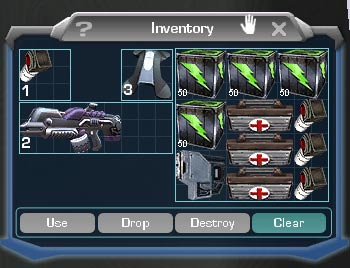

 [Agile Exo-Suit](../armor/Agile_Exo-Suit.md) with
[Jammer grenades](../weapons/Jammer_Grenade.md), a
[Telepad](../weapons/Telepad.md), a [Pulsar](../weapons/Pulsar.md), a
[REK](../weapons/Remote_Electronics_Kit.md), and
[MedKits](../items/MedKit.md)\]\]

**Inventory** represents a soldier's personal available storage space. The
inventory space consists of [holsters](../etc/Holster.md), from which
[weapons](../weapons/Weapons_Index.md) and certain items can be quickly
retrieved, and general [backpack](Backpack.md) space, where other items of
interest may be kept.

Each type of [armor](../armor/Armor_Index.md) has a different size of inventory.
[Infiltration Suits](../armor/Infiltration_Suit.md) have the smallest and
[MAXes](../armor/Mechanized_Assault_Exo-Suit.md) have the largest. Each
inventory type displays a holster and backpack space. Items placed in the
holsters appear on your avatar.

To open your Inventory, press the "I" key or approach an
[Equipment terminal](../items/Equipment_Terminal.md),
[locker](../items/Lockers.md), or vehicle [trunk](Trunk.md) and press the "G"
key. This will open up your Inventory window and allow you to customize your
[loadout](Loadout.md).

You may double click or click and drag to place an item in your inventory.
Right-clicking will swap an item between holster slots depending on their size.

When you die, your backpack will remain where you fell, along with whatever
items were in your inventory at the time. Backpacks will
[deconstruct](Deconstruct.md) more rapidly in areas with a larger number of
people or activity going on.

